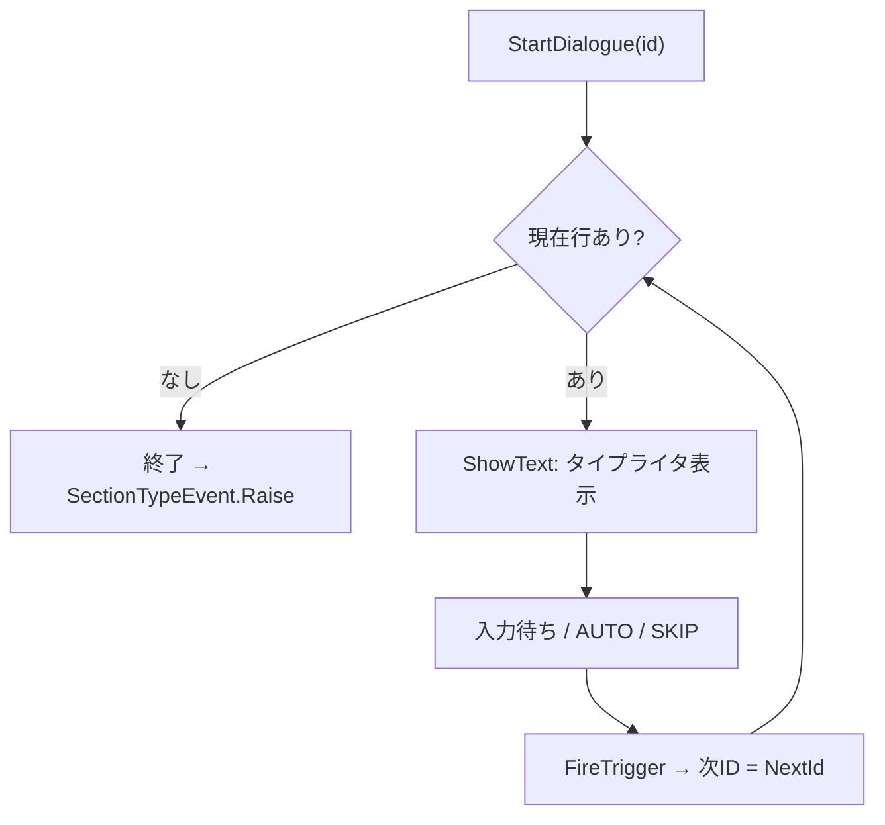
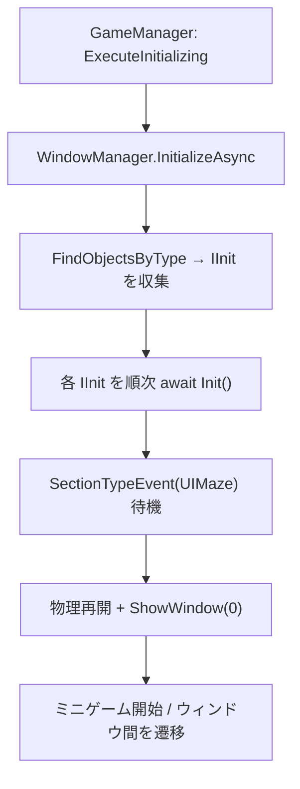

<!-- TODO: 「CHUNG」を本名に差し替え可 -->
# CHUNG — 開発ポートフォリオ

Unity を中心に活動するゲームプログラマー。チーム開発において、システム設計・実装を担当しています。
各作品の担当範囲と、実際に書いたコードを収録しています。

---

## 制作物

## 1. UIちゃんと和解せよ！（UI 自体が敵になるアクション恋愛SLG / 8人チーム制作）

OS風のウィンドウやシステムメッセージなど、**あらゆる UI が敵として立ちはだかる**「UIちゃん」と、対話と行動で和解していく 2.5D ゲーム。

- **役割**：プログラマー（**対話システム** / **UIメイズ ミニゲーム** ＋ タイトル・リザルト）
- **出展**：**BitSummit 2026** 出展・受賞作<!-- TODO: 受賞名 / プレイ可能リンクを記入 -->
- **エンジン**：Unity 6 (6000.0.59f2) / URP
- **使用技術**：C# · UniTask · DOTween · Febucci Text Animator · TextMeshPro · Feel · Input System
- **設計**：FSM・イベント駆動・インターフェースファースト
- **規模**：担当 約 7,600 行 / 85 ファイル（コミット 92）
- 🔗 **コード**：[`ui-chan-to-wakai-seyo/src/`](ui-chan-to-wakai-seyo/src/)

  

### 担当① 対話システム（[`src/Dialogue/`](ui-chan-to-wakai-seyo/src/Dialogue/)）
CSV 駆動のシナリオエンジン。タイトル〜本編〜リザルトを貫くナラティブ基盤を実装。

- **UniTask + CancellationToken** による非同期対話ループ。再呼び出し時は走行中の対話を安全に打ち切り（リーク無し）。
- **Febucci タイプライタ**統合（`onTextShowed` 完了検知 / フレーム単位スキップ）。
- **JP⇄EN リアルタイム言語切替** — 表示中の行を即再レンダリング。
- 失敗回数連動の **Good/Normal/Bad エンディング分岐**。

### 担当② UIメイズ ミニゲーム（[`src/UIMazeV2/`](ui-chan-to-wakai-seyo/src/UIMazeV2/)）
OS デスクトップ風ステージ。複数ウィンドウに **3種のミニゲーム**（見下ろし迷路 / 横スクロール / クレジット走破）が同居し、プレイヤー1体を共有。

- **統合初期化** — `IInitializable`/`IInit` 準拠。依存をハードコードせず順次初期化、初期化中は物理停止で落下死を防止。
- **SpriteMask** によるウィンドウ単位クリッピング＋プレイヤー追従フレーム。
- 軌跡記録→再生で追う**“自分の影”ゴースト**、dissolve / glitch シェーダ演出（`MaterialPropertyBlock`）。
- 落下障害物の**枠貫通衝突**、着地連動のウィンドウ縮小、双方向テレポート、ローカライズドボイス。

  
  

<!--
## 2. （次のプロジェクト名）（ジャンル / 制作規模）
- 役割：
- 使用技術：
- コード：
-->

---

## 使用言語

**C#**（メイン）／ ShaderLab・HLSL（演出シェーダ）
