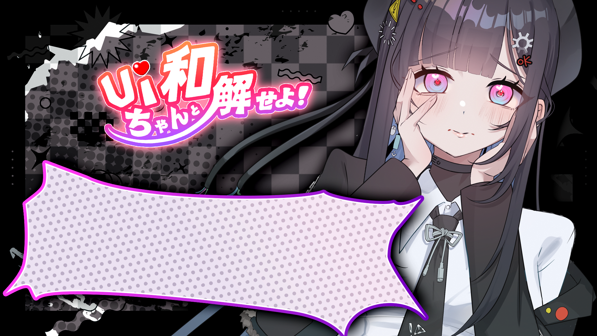
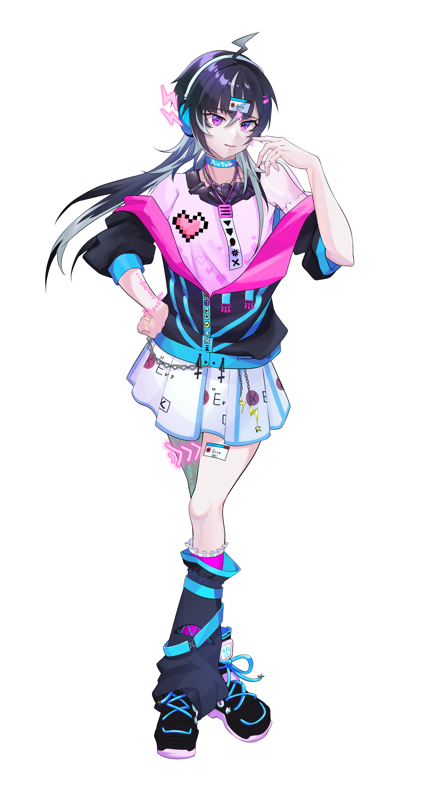
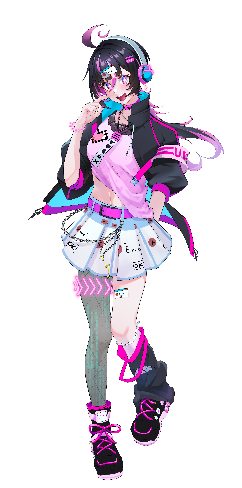
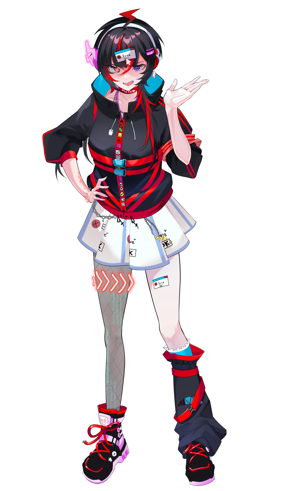
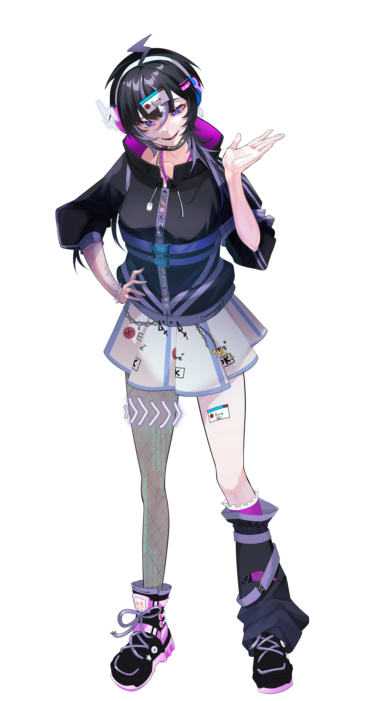
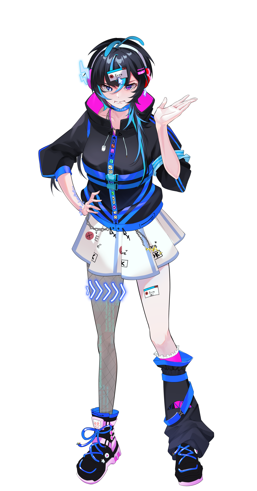
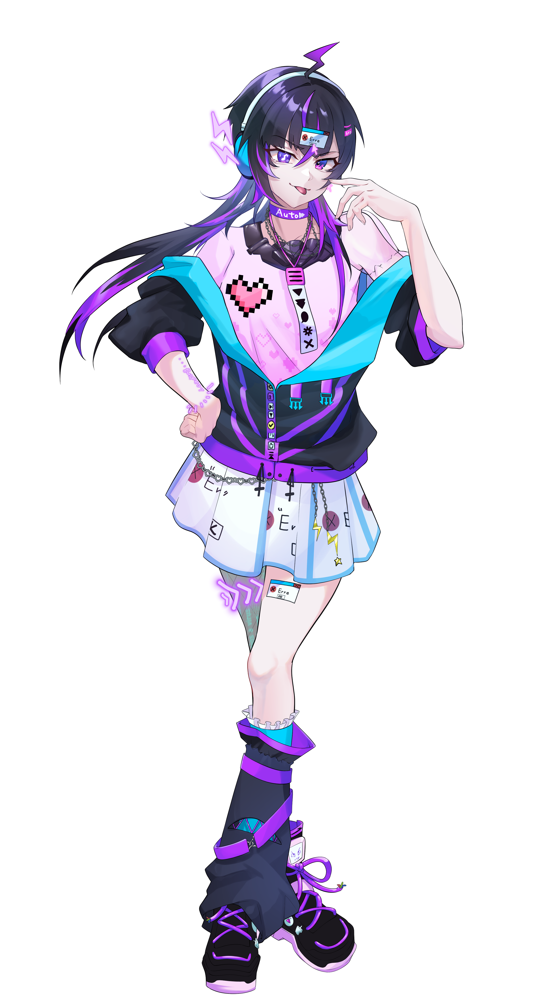
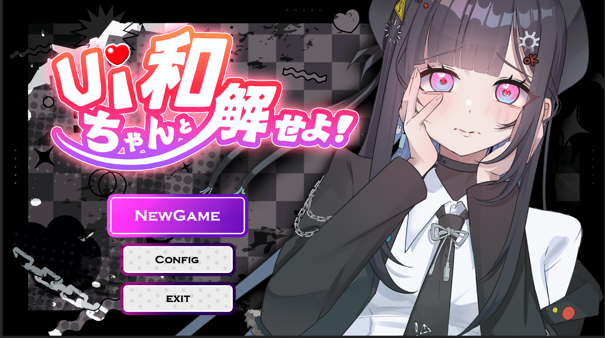

# UIちゃんと和解せよ！ — 開発ポートフォリオ

> **UI 自体が敵になる**アクション恋愛シミュレーション。
> OS風のウィンドウ、システムメッセージ、進捗バー……あらゆるUIが立ちはだかる「UIちゃん」と、プレイヤーが対話と行動で和解していく 2.5D ゲーム。

<p align="center">
  
</p>

> 📌 本リポジトリは **BitSummit 2026 出展作『UIちゃんと和解せよ！』**（8名チーム開発）における筆者（Mellowy）の担当領域を抜粋した**個人ポートフォリオ**です。担当した全 C# ソースを [`src/`](src/) に収録しています。

---

## 📌 プロジェクト概要

| 項目 | 内容 |
|---|---|
| ジャンル | アクション恋愛シミュレーション（UI が敵になるゲーム） |
| 出展 | **BitSummit 2026**（受賞作）<!-- TODO: 受賞名を記入（例：◯◯賞） --> |
| エンジン | Unity 6 (6000.0.59f2) / URP / 2.5D |
| チーム | 8名（プログラマー3名・アーティスト・UIデザイナー・プランナー） |
| 担当 | プログラマー3名のうち1名 |

## 👤 担当範囲

ゲームの**ナラティブ基盤**と、看板ミニゲームである**「UIメイズ」**を一人で設計・実装。コミット数 **92**、担当コード **約7,600行 / 85ファイル**。

| 担当システム | 内容 | 規模 | コード |
|---|---|---|---|
| **① 対話システム** | CSV 駆動のシナリオエンジン。タイトル〜本編〜リザルトを貫くナラティブ基盤。多言語・ボイス・分岐・エンディング分岐まで内包 | 約1,200行 / 7ファイル | [`src/Dialogue/`](src/Dialogue/) |
| **② UIMazeV2 ミニゲーム** | OS風ウィンドウが複数現れ、それぞれ異なるミニゲーム（見下ろし迷路・横スクロール・クレジット走破）を内包する複合ミニゲーム | 約4,200行 / 46ファイル | [`src/UIMazeV2/`](src/UIMazeV2/) |

> タイトル画面（言語切替・演出 → [`src/Title/`](src/Title/)）とリザルト画面（エンディング分岐 → [`src/Result/`](src/Result/)）も、上記2システムの一部として担当しています。

## 🧰 使用技術

`C#` `Unity 6 / URP` `UniTask（非同期）` `DOTween（トゥイーン）` `Text Animator for Unity / febucci v3.x` `TextMeshPro` `Feel / More Mountains（ゲームフィール）` `Unity Input System` `Cinemachine` `Shader / MaterialPropertyBlock`

設計原則：**FSM・イベント駆動・インターフェースファースト**。状態は C# delegate / ScriptableObject イベントで疎結合に連携。

## 📂 リポジトリ構成

```
.
├─ README.md
├─ screenshots/          スクリーンショット・表情立ち絵
└─ src/                  担当した全 C# ソース（85ファイル）
   ├─ Dialogue/          ① 対話システム
   ├─ UIMazeV2/          ② UIメイズ（複合ミニゲーム・現行版）
   ├─ UIMaze/            　 UIメイズ 旧版（v1）
   ├─ Title/             　 タイトル・言語管理
   ├─ Result/            　 リザルト
   ├─ CameraClamp.cs     　 共有ユーティリティ
   ├─ SafeSE.cs
   └─ SceneTransitionManager.cs
```

> ※ `src/` の各スクリプトは実プロジェクトから抜粋した**閲覧用**です。`IInit`/`IInitializable`・`SectionTypeEvent`・`GameoverCounter` 等の一部はチーム共通基盤（他メンバー実装）で、本コードはそれらに準拠・連携しています。

---

# システム ① 対話システム（Dialogue System）

`namespace Dialogue` ／ 約1,200行・7ファイル ／ 📁 [`src/Dialogue/`](src/Dialogue/)

タイトル → ミニゲーム → リザルトという**ゲーム全体の進行を駆動する**ナラティブエンジン。市販のアセットに頼らず、**多言語・ボイス・選択肢分岐・エンディング分岐・タイプライタ演出**を満たす要件に合わせてフルスクラッチで実装しました。

<p align="center">
  
  
  
  
  
  
  <br>
  <sub>▲ CSV の Image 列からランタイムで差し替わる「UIちゃん」表情立ち絵</sub>
</p>

### 設計の要点

- **CSV 駆動のコンテンツパイプライン** — シナリオはコードにハードコードせず、[`DialogueLoader`](src/Dialogue/DialogueLoader.cs) が `Resources/dialogue.csv` を実行時ロードして `Dictionary<string, DialogueData>` を構築。プランナーは CSV を編集するだけで、再コンパイルなしにセリフ・分岐・ボイス・立ち絵・シーン遷移を追加できます。
- **引用符内の改行に対応した自前 CSV パーサ** — `SplitCsvIntoLogicalRows()` で引用符の開閉状態（`inQuotes`）を追跡し、セル内改行を含む複数行セリフを1論理行として正しく解釈。CRLF にも対応。
- **状態機械ループ** — [`DialogueManager`](src/Dialogue/DialogueManager.cs) の `StartDialogue(id)` が `while (_current != null)` のループで1行ずつ進行。`NextId` による逐次進行と、`ChoiceA/ChoiceB` による二択分岐を切り替えます。

### 技術的ハイライト

**⏱ UniTask + CancellationToken による安全な非同期制御**
進行待ち・タイプ表示・選択待ちをすべて `UniTask` の `async/await` で記述。`CancellationTokenSource` を1本持ち、外部から `StartDialogue()` が再呼び出しされると旧トークンを `Cancel() → Dispose()` して**走行中の対話ループを安全に打ち切り**。`finally` でボイス停止を保証し、タスクの取り残し・リークを防止。`_current != line` ガードでループ途中の差し替えも検知します。

**⌨ Febucci タイプライタ演出 + フレーム単位のスキップ**
[`DialogueUI`](src/Dialogue/DialogueUI.cs) で `Febucci.TextAnimatorForUnity` の `TypewriterComponent` を統合。`onTextShowed` コールバックで完了を検知し（`isShowingText` ポーリングより信頼性が高い）、表示中は毎フレーム入力を監視して `SkipTypewriter()` で全文即時表示。表示開始直後に `UniTask.Yield()` で**1フレーム捨てる**ことで、前画面の入力バッファによる誤スキップを防止しています。

**🌐 表示中のリアルタイム言語切替（JP ⇄ EN）**
[`DialogueData`](src/Dialogue/DialogueData.cs) の `GetText()` / `GetVoice()` が `LanguageManager.CurrentLanguage` を参照する設計。プレイ中に言語をトグルすると `OnLanguageChanged` 経由で**現在表示中の行を即座に再レンダリング**（タイプアニメは再生せず差し替え）し、ボイスも切替。シーン再ロード不要。

**🔀 選択肢分岐とエンディング分岐**
二択 UI は十字キー/スティックで選択（黄色ハイライト）、決定で `ChoiceAId/ChoiceBId` を次状態に。リザルトのセリフは共通の `GameoverCounter`（失敗回数）に応じて **Good / Normal / Bad** の3エンディングへ自動分岐（閾値は Inspector 可変）。

**🎛 入力抽象化・防御的実装・デバッグ支援**
[`DialogueInputs`](src/Dialogue/DialogueInputs.cs) で Gamepad（A/B）と Keyboard（Z/Space/Enter）を単一の `IsAdvancePressed()` に統合（新 Input System）。ボイス再生は「データ無し・音源未設定・空セル・ファイル欠落」の各段で graceful にログ＋早期 return し例外を投げない。`#if UNITY_EDITOR` で完全分離した IMGUI [デバッグオーバーレイ](src/Dialogue/DialogueDebugOverlay.cs)（言語トグル / AUTO・SKIP / エンディング分岐テスト / 任意 ID 開始 / セクションスキップ）を備え、製品ビルドはゼロオーバーヘッド。

### 他プログラマーとの統合点（公開API）
唯一の結合点は `dialogueManager.StartDialogue("id").Forget();` の一行。進行完了は戻り値ではなく、CSV の `Trigger` 列が共通の `SectionTypeEvent` を `Raise()` することで通知する**イベント駆動**設計とし、対話側がシーン構成を一切知らずに済むようにしています。

---

# システム ② UIMazeV2 ミニゲームシステム

`namespace UIMazeV2` ／ 約4,200行・46ファイル ／ 📁 [`src/UIMazeV2/`](src/UIMazeV2/)

**コンセプト：OS のデスクトップそのものがステージ。** ウィンドウ風のフレームが複数現れ、その中に見下ろし迷路・横スクロールアクション・クレジット走破という**3種の独立したミニゲーム**が同居。プレイヤーキャラは1体を共有し、`SpriteMask` でウィンドウ単位にクリッピングされながらウィンドウ間を渡り歩きます。

<p align="center">
  
</p>

### アーキテクチャ — 統合初期化フロー

- **[`WindowManager`](src/UIMazeV2/WindowManager.cs)（最上位オーケストレータ）** は、チーム共通の `IInitializable` / `IInit` インターフェース契約に準拠して実装。`InitializeAsync()` 内で `FindObjectsByType<MonoBehaviour>().OfType<IInit>()` により全初期化対象を**自動収集**し、順次 `await Init()`。依存をハードコードしないプラグ&プレイな初期化順を実現。
- 初期化中の落下死を防ぐため `Awake()` で全コントローラを停止・`rb.simulated = false` にし、セットアップ完了後に物理を再開する**初期化タイミング制御**。
- `ShowWindow(int index)` は「対象ウィンドウのみ `SetActive` → 対応コントローラのみ有効化（`OnEnable` カスケード）→ 共有プレイヤーをスポーン地点へ → ソートレイヤー更新 → ボイス再生 → ガイド矢印リセット」を**1つのアトミック操作**にまとめています。

### ウィンドウ表現とマスキング
各ウィンドウは `SpriteMask`、プレイヤーは `SpriteMaskInteraction.VisibleInsideMask` でフレーム内にクリップ（Unity ネイティブ機能を用いた部分クリッピング）。[`WindowFrame`](src/UIMazeV2/WindowFrame.cs) が毎フレーム、共有プレイヤー位置を `CameraClamp.ClampToCamera()` で画面内に収めつつ追従し、[`WindowBounds`](src/UIMazeV2/WindowBoudns.cs) が `LateUpdate()` でマスク境界＋各辺インセットに移動を制限。

### 3つのミニゲーム
1. **見下ろし迷路** — 4方向移動（重力ゼロ）。[`GhostManager`](src/UIMazeV2/GhostManager.cs) がプレイヤーの軌跡を 0.05 秒間隔で記録し、5秒遅れで [`GhostClone`](src/UIMazeV2/GhostClone.cs) が同じ経路を再生して追いかけてくる“自分の影”。[`GhostFear`](src/UIMazeV2/GhostFear.cs) が残像トレイルと白黒フリッカ（sine / square 切替）でホラー演出。
2. **横スクロールアクション** — [`PlatformerPlayer`](src/UIMazeV2/PlatformerPlayer.cs) のジャンプ操作。[`WindowShrink`](src/UIMazeV2/WindowShrink.cs) で**着地後30秒かけてウィンドウが右から30%幅まで縮小**。[`ObstacleWindow`](src/UIMazeV2/ObstacleWindow.cs) が「遅延→落下→衝突→障害物放出→再生成」を `CancellationTokenSource` 付き `UniTaskVoid` ループで自律実行。落下物は `Physics2D.IgnoreCollision()` でウィンドウ枠を貫通。
3. **クレジット走破** — [`CreditScroller`](src/UIMazeV2/CreditScroller.cs) が下方向スクロールするステージを走破。[`TeleportPlatform`](src/UIMazeV2/TeleportPlatform.cs)（クールダウン付き双方向ワープ）と、時間生存 or 終点接触で判定する [`SurvivalClear`](src/UIMazeV2/SurvivalClear.cs) の二系統クリア。

### 技術的ハイライト
- **シェーダ演出** — [`PlayerDissolveEffect`](src/UIMazeV2/PlayerDissolveEffect.cs) がウィンドウ遷移時に `_DissolveAmount` を `MaterialPropertyBlock`（マテリアル複製なし）でアニメさせ、上からプレイヤーを溶かす/復元。
- **グリッチ演出基盤** — [`UIChanGlitchController`](src/UIMazeV2/UIChanGlitchController.cs) を抽象基底に、`DOTween.Sequence()` で入場 → ループパルス → ワンショット反応を宣言的に構築。ミニゲーム毎の `IsGateOpen()` を override（M1/M2/M3）。
- **非同期演出の並列化** — 死亡シーケンスは `UniTask.WhenAll()` で「点滅・ウィンドウ縮退・障害物再配置・プレイヤー復帰」を同時進行。`destroyCancellationToken` で破棄時に自動キャンセル。
- **ローカライズドボイス** — [`LocalizedVoicePlayer`](src/UIMazeV2/LocalizedVoicePlayer.cs) が CSV ID（`jvoice_/evoice_`）からボイスを引き、`nextId` で連鎖再生。言語に応じて Resources パスを動的切替。
- **3Dカメラ導入演出** — [`MonitorIntroCamera`](src/UIMazeV2/MonitorIntroCamera.cs) がプルバック→接近の多段イージングでモニターに“入っていく”導入を演出。
- **イベント駆動の疎結合** — `OnPlayerDeath` / `OnPlayerRespawn` / `OnTeleport` 等の C# イベントで、各 Manager が互いを直接参照せず連携。

### 設計上の工夫（抜粋）
- 非同期初期化中の物理停止による**落下死防止**。
- 落下障害物の**多重レイヤー衝突**（プラットフォームを貫通しつつ枠に当たる）。
- **シーン再ロードなしのランタイム言語切替**（`ReinitializeForLanguageChange()` でステージ根とターゲットを再選択）。
- スクロール後でも正しく戻すため、テレポート初期座標を**起動時にキャッシュ**して `ResetState()` で復元。

---

## 📊 コード規模

| 指標 | 値 |
|---|---|
| 担当コミット数 | **92** |
| 担当コード総量 | **約7,600行 / 85ファイル** |
| 対話システム | 約1,200行（最大モジュール `DialogueManager` 400行超） |
| UIMazeV2 | 約4,200行（`WindowManager` 222 / `UIChanGlitchController` 210 / `CreditMinigameManager` 188 / `Minigame2Manager` 182 …） |

## 🖼 スクリーンショット

| タイトル | ゲームプレイ |
|---|---|
|  |  |

<!-- TODO: プレイ動画 / GIF があればここに追加すると訴求力が大きく上がります -->

## 🎯 このプロジェクトで示せること

- **市販アセットに頼らない**システム設計力（CSV シナリオエンジン・複合ミニゲーム基盤をフルスクラッチ）。
- **モダンな非同期 C#**（UniTask + CancellationToken）による堅牢なライフサイクル管理。
- **チーム共通アーキテクチャ**（`IInitializable`/`IInit`、ScriptableObject イベント）への準拠と統合。
- 多言語・ボイス・分岐といった**プロダクション要件**への対応と、デバッグ支援まで含めた開発者エルゴノミクスへの配慮。
