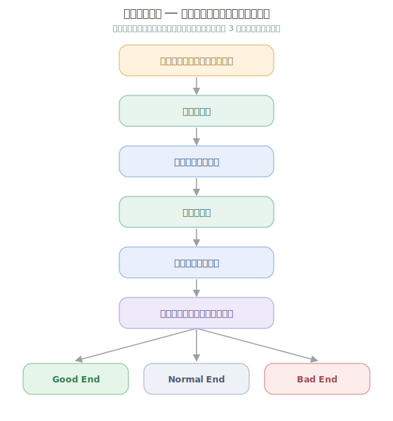
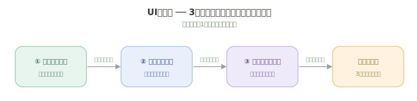

<!-- TODO: 「CHUNG」を本名に差し替え可 -->
# CHUNG — 開発ポートフォリオ

---

## 制作物

## 1. Reconcile with UIChan（9人チーム制作）

- **役割**：プログラマー（**対話システム** / **UI迷路 ミニゲーム** ＋ タイトル・リザルト）
- **エンジン**：Unity 6 (6000.0.59f2) / URP
- **受賞**： BitSummitGameJamにて、協賛企業賞および審査員賞をチームで受賞
- **設計**：UniTask による非同期制御 ／ イベント・デリゲート駆動の疎結合 ／ CSV データ駆動
- **コード**：[`Reconcile-with-UIChan/src/`](Reconcile-with-UIChan/src/)
- **プレイ**：[itch.io（BitSummit Game Jam 2026）](https://bitsummit-gamejam.itch.io/uityantowakaiseyo)

### 担当① 対話システム（[`src/Dialogue/`](Reconcile-with-UIChan/src/Dialogue/)）
CSV 駆動のシナリオエンジン。タイトル〜本編〜リザルトを貫くナラティブ基盤を実装。

- **UniTask + CancellationToken** による非同期対話ループ（再呼び出し時も安全に中断）。
- **JP⇄EN マルチ言語対応

  

### 担当② UI迷路 ミニゲーム（[`src/UIMazeV2/`](Reconcile-with-UIChan/src/UIMazeV2/)）
1つのミニゲーム枠の中に **3種のミニゲーム**（見下ろし迷路 / 横スクロール / クレジット）が入れ替わりで登場し、プレイヤー1体を引き継いで進行する。

- **ウィンドウ遷移** — クリアごとに `ShowWindow()` で対象ウィンドウのみを表示し、プレイヤー・カメラ・サウンドを次のミニゲームへ引き継ぐ。
- **SpriteMask** によるウィンドウ単位クリッピング＋プレイヤー追従フレーム。
- 軌跡記録→再生で追う**“自分の影”ゴースト**、dissolve / glitch シェーダ演出。
- 落下障害物の枠貫通衝突、着地連動のウィンドウ縮小、双方向テレポート、ローカライズドボイス。

  

## 2. DECK::EXEC(仮)（2D パズル × カードプログラミング / 個人制作・制作中）

- **役割**：個人制作
- **エンジン**：Unity 6.3 / URP
- **設計**：ScriptableObject データ駆動 ／ カード効果は `ICardEffect`（Command）／ R3 による状態購読 ／ DI で疎結合
- **現在地**：コアループが動作 — カード4種・敵AI・ターン制実行・ミッション/ステージ進行・セーブ・予測プレビューUI
- **今後**：カード語彙の拡張（条件分岐・繰り返し・Undo 等）、ステージ制作、演出・サウンド

## 3. TheHollowRite(仮)（3D ボスアクション / 個人制作・制作中）

- **役割**：個人制作
- **エンジン**：Unreal Engine 5.7 / C++
- **設計**：データ駆動の攻撃テーブル（`FTHRBossAttackDef` 等）／ 体力・ダメージ・無敵をプレイヤー/ボス共用コンポーネント化 ／ アニメ通知ベースのヒットボックス
- **現在地**：3人称プレイヤー（移動・回避iフレーム・近接/射撃・武器切替）、ボス3フェーズHP、攻撃モンタージュ7種、BT/Blackboard 連携、メニュー→アリーナのループが動作
- **今後**：ボス攻撃テーブルの調整、AOE/弾幕チャネルの統合、演出・バランス調整

---

## 使用言語

- **C#** (Unityでのゲーム開発)
- **C++** (Unrealでのゲーム開発)
- **Python** (大学講義。機械学習目的のPytorchなど)
