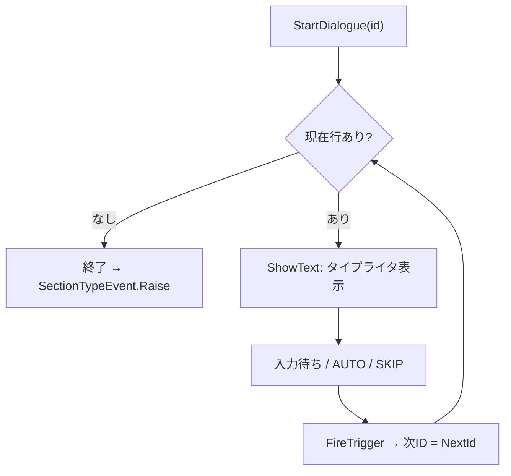

<!-- TODO: 「CHUNG」を本名に差し替え可 -->
# CHUNG — 開発ポートフォリオ

---

## 制作物

## 1. Reconcile with UIChan（9人チーム制作）

- **役割**：プログラマー（**対話システム** / **UIメイズ ミニゲーム** ＋ タイトル・リザルト）
- **出展**：**BitSummit 2026** 出展・受賞作<!-- TODO: 受賞名 / プレイ可能リンクを記入 -->
- **エンジン**：Unity 6 (6000.0.59f2) / URP
- **設計**：FSM・イベント駆動・インターフェースファースト
- 🔗 **コード**：[`ui-chan-to-wakai-seyo/src/`](ui-chan-to-wakai-seyo/src/)

### 担当① 対話システム（[`src/Dialogue/`](ui-chan-to-wakai-seyo/src/Dialogue/)）
CSV 駆動のシナリオエンジン。タイトル〜本編〜リザルトを貫くナラティブ基盤を実装。

### 担当② UI迷路 ミニゲーム（[`src/UIMazeV2/`](ui-chan-to-wakai-seyo/src/UIMazeV2/)）
1つのミニゲーム枠の中に **3種のミニゲーム**（見下ろし迷路 / 横スクロール / クレジット）が入れ替わりで登場し、プレイヤー1体を引き継いで進行する。

- **ウィンドウ遷移** — クリアごとに `ShowWindow()` で対象ウィンドウのみを表示し、プレイヤー・カメラ・サウンドを次のミニゲームへ引き継ぐ。
- **SpriteMask** によるウィンドウ単位クリッピング＋プレイヤー追従フレーム。

<!--
## 2. （次のプロジェクト名）（ジャンル / 制作規模）
- 役割：
- 使用技術：
- コード：
-->

---

## 使用言語

- **C#** (Unityでのゲーム開発)
- **C++** (Unrealでのゲーム開発)
- **Python** (大学講義。機械学習目的のPytorchなど)
